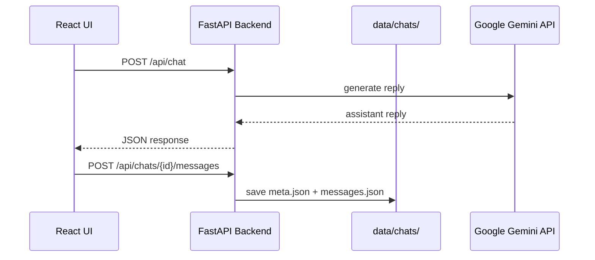

# Implementation Status

What has been built so far for the US History Chatbot demo.

> **Last updated:** Phase 5 complete  
> **Related docs:** [plan.md](./plan.md) · [setup.md](./setup.md)

---

## Summary

| Phase | Status | Description |
|-------|--------|-------------|
| **Phase 1** | **Done** | Core text chat — React UI + FastAPI backend + Gemini API |
| **Phase 2** | **Done** | Multi-chat and local file persistence |
| **Phase 3** | **Done** | Voice input (Start/Stop/Delete/Send) and text-to-speech output — **verified** |
| **Phase 4** | **Done** | PDF knowledge base — load, chunk, retrieve, inject into prompts — **verified** |
| **Phase 5** | **Done** | Visual polish — side flag, history gallery, demo-ready layout |

---

## Phase 5 — What Works

### Visual features

- **Left-side US flag accent** — fixed vertical strip with subtle opacity
- **History gallery** in header — Declaration of Independence and Abraham Lincoln artwork
- **Polished header card** — title, tagline, knowledge base badge
- **Refined panels** — semi-transparent sidebar and chat window on gradient background
- **Responsive** — narrower side flag and stacked layout on mobile

### Assets (`frontend/public/images/`)

| File | Source |
|------|--------|
| `us-flag.svg` | Wikimedia Commons (US flag) |
| `declaration.jpg` | John Trumbull, Declaration of Independence (Wikimedia Commons) |
| `lincoln.jpg` | Abraham Lincoln portrait (Wikimedia Commons) |

See `frontend/public/images/README.md` for replacing placeholders with photo thumbnails.

---

## Phase 4 — What Works

### User-facing features

- **Knowledge base badge** in header when a PDF is loaded (filename + chunk count)
- Answers **blend** general US history with content from the PDF when relevant
- Asking about topics in the PDF (e.g. Wilmington Coup of 1898) uses that material

### Backend features

- Loads first `.pdf`, `.txt`, or `.md` from `knowledge/` on startup
- Extracts text with `pypdf` (PDF) or plain read (txt/md)
- Splits into overlapping chunks (~600 chars)
- Keyword retrieval — top 5 relevant chunks appended to system prompt per question
- `GET /api/knowledge/status` — load status
- `POST /api/knowledge/reload` — re-read files after replacing PDF (no full restart needed)

### Current sample file

- `knowledge/The Wilmington Coup of 1898.pdf` — 4 chunks loaded

### Test question

> *"What happened in the Wilmington Coup of 1898?"*

### Verified (Phase 4)

- Knowledge base badge shows in header (`The Wilmington Coup of 1898.pdf`, 4 chunks)
- PDF-specific questions answered using material from the knowledge base
- General US history questions still work (blend mode)
- Replace PDF + `POST /api/knowledge/reload` reloads without code changes

---

## Phase 3 — What Works

### User-facing features

- **Voice controls:** Start, Stop, Delete, Send buttons above the text input
- **Start** — records microphone audio + live speech-to-text transcription
- **Stop** — ends recording; transcription shown for review
- **Delete** — discards recording and transcription
- **Send** — submits transcribed text as a user message (with audio saved if recorded)
- **Play** button on user messages — replays saved voice recording
- **Speak** button on assistant messages — reads reply aloud via browser text-to-speech (manual)
- Assistant replies remain **text only** (no assistant audio files)

### Backend features

- `POST /api/chats/{id}/audio` — upload user audio (`.webm`)
- `GET /api/chats/{id}/audio/{filename}` — stream saved recording
- Messages may include optional `audio_file` field in `messages.json`
- Audio stored under `data/chats/{id}/audio/`

### Storage layout (with audio)

```
data/chats/{chatId}/
├── meta.json
├── messages.json
└── audio/
    └── {uuid}.webm
```

### Verified (Phase 3)

- Start / Stop / Delete / Send voice workflow works in Chrome/Edge
- User audio saved and **Play** button replays recording after page refresh
- **Speak** button reads assistant replies aloud via browser TTS
- Assistant responses remain text-only (no assistant audio files on disk)

---

## Phase 2 — What Works

### User-facing features

- **+ New Chat** button — starts a fresh conversation (not saved until first message)
- **Sidebar** — lists all saved chats, sorted by most recently updated
- **Switch chats** — click a chat in the sidebar to load its history
- **Auto-save** — after each exchange, messages are saved to disk
- **Persist on refresh** — reloading the browser restores saved chats
- **Auto-titled chats** — title is taken from the first user message (truncated at 60 chars)

### Backend features

- Local file storage under `data/chats/{chatId}/`
  - `meta.json` — id, title, created_at, updated_at
  - `messages.json` — full message history with timestamps
- Chat CRUD API endpoints (see API section below)
- UUID validation on chat IDs (prevents path traversal)
- Request timeout (15s) — shows error instead of infinite "Loading chats…"

### Verified (Phase 2)

- Sidebar lists saved chats; switching between them works
- New chats auto-title from first message
- Data persists after page refresh
- Backend hang on port 8000 documented in Known Issues (restart if API times out)

### Storage layout example

```
data/chats/
└── d279a231-3289-4e9a-ab47-df26ceb949d1/
    ├── meta.json
    └── messages.json
```

---

## Phase 1 — What Works

### User-facing features

- Single-page chat UI at http://localhost:5173
- Text input and **Send** button
- User and assistant message bubbles ("You" / "Historian")
- Loading indicator ("Thinking…") while waiting for a reply
- Error banner if the API call fails
- Empty-state prompt when no messages yet
- Auto-scroll to the latest message
- **Multi-turn conversation** within a session (full message history sent to the backend each time)

### Backend features

- FastAPI server on http://localhost:8000
- Proxies chat requests to **Google Gemini** (`gemini-2.5-flash` by default)
- US history **system prompt** — keeps answers focused on American history
- API key loaded from `.env` (never exposed to the browser)
- CORS enabled for the Vite dev server
- Health check endpoint for verification

### Verified (Phase 1)

- API test: *"Who was the first US president?"* → correct answer about George Washington
- Manual UI test: *"When did the US railroads start?"* → detailed answer about B&O railroad (1828)

---

## What Does NOT Work Yet

| Feature | Status |
|---------|--------|
| Delete chat | **Done** — trash icon in sidebar; removes chat + audio from disk |

**All planned demo phases (1–5) are implemented.**

---

## Architecture



---

## Project Structure (current)

```
ChatBot/
├── backend/
│   ├── main.py           # FastAPI app, routes, CORS
│   ├── llm.py            # Gemini client and chat logic
│   ├── storage.py        # Chat file I/O (data/chats/)
│   ├── config.py         # .env loading, system prompt
│   ├── requirements.txt  # Python dependencies
│   └── .venv/            # Python virtual environment (local, not committed)
├── data/chats/           # Saved conversations (gitignored)
├── frontend/
│   ├── src/
│   │   ├── App.jsx               # Layout, chat list state, routing
│   │   ├── App.css               # Chat UI + sidebar styles
│   │   ├── main.jsx              # React entry point
│   │   ├── index.css             # Global styles
│   │   ├── api/
│   │   │   └── client.js         # API client (chat, persistence, audio upload)
│   │   ├── utils/
│   │   │   └── speech.js         # Speech recognition + TTS helpers
│   │   └── components/
│   │       ├── ChatWindow.jsx    # Input form, voice controls, auto-save
│   │       ├── ChatList.jsx      # Sidebar with saved chats
│   │       ├── VoiceControls.jsx # Start / Stop / Delete / Send
│   │       └── MessageBubble.jsx # Message bubble with Play / Speak
│   ├── public/
│   │   ├── favicon.svg
│   │   └── favicon.ico
│   ├── index.html
│   ├── package.json
│   └── vite.config.js    # Dev server + API proxy
├── docs/
│   ├── plan.md           # Requirements and phased plan
│   ├── setup.md          # Install and run instructions
│   └── implementation.md # This file
├── .env                  # API key (gitignored)
├── .env.example          # Template for .env
├── .gitignore
└── README.md
```

---

## API Endpoints

### `GET /api/health`

Health check.

**Response:**

```json
{
  "status": "ok",
  "model": "gemini-2.5-flash"
}
```

**Try it:** http://localhost:8000/api/health  
**Swagger UI:** http://localhost:8000/docs

---

### `POST /api/chat`

Send a conversation and receive the assistant's next reply.

**Request body:**

```json
{
  "messages": [
    { "role": "user", "content": "Who was the first US president?" }
  ]
}
```

For multi-turn chat, include the full history:

```json
{
  "messages": [
    { "role": "user", "content": "Who was Lincoln?" },
    { "role": "assistant", "content": "Abraham Lincoln was the 16th president..." },
    { "role": "user", "content": "When was he president?" }
  ]
}
```

**Response:**

```json
{
  "message": {
    "role": "assistant",
    "content": "George Washington was the first President of the United States."
  }
}
```

**Errors:**

| Code | Cause |
|------|-------|
| 400 | Invalid request (empty messages, last message not from user) |
| 502 | Gemini API error (bad key, quota exceeded, network issue) |

---

### `POST /api/chats`

Create a new chat session. Returns a UUID only — nothing is written to disk until the first message is saved.

**Response:**

```json
{ "id": "d279a231-3289-4e9a-ab47-df26ceb949d1" }
```

---

### `GET /api/chats`

List all saved chats, sorted by most recently updated.

**Response:**

```json
[
  {
    "id": "d279a231-3289-4e9a-ab47-df26ceb949d1",
    "title": "When did the US railroads start?",
    "created_at": "2026-07-08T15:00:00+00:00",
    "updated_at": "2026-07-08T15:01:00+00:00"
  }
]
```

---

### `GET /api/chats/{id}`

Load a single chat with full message history.

**Response:**

```json
{
  "id": "d279a231-3289-4e9a-ab47-df26ceb949d1",
  "title": "When did the US railroads start?",
  "created_at": "2026-07-08T15:00:00+00:00",
  "updated_at": "2026-07-08T15:01:00+00:00",
  "messages": [
    { "role": "user", "content": "When did the US railroads start?" },
    { "role": "assistant", "content": "US railroads began in the early 19th century..." }
  ]
}
```

---

### `POST /api/chats/{id}/messages`

Save the full conversation to disk. Called automatically after each exchange.

**Request body:**

```json
{
  "messages": [
    { "role": "user", "content": "Who was Lincoln?", "audio_file": "abc-123.webm" },
    { "role": "assistant", "content": "Abraham Lincoln was the 16th president..." }
  ]
}
```

**Response:** Same as `GET /api/chats/{id}`.

---

### `POST /api/chats/{id}/audio`

Upload a user voice recording (multipart form).

**Form field:** `file` — audio blob (`.webm`)

**Response:**

```json
{ "filename": "d279a231-3289-4e9a-ab47-df26ceb949d1.webm" }
```

---

### `GET /api/chats/{id}/audio/{filename}`

Stream a saved user recording.

**Response:** `audio/webm` file

---

### `GET /api/knowledge/status`

Knowledge base load status.

**Response:**

```json
{
  "loaded": true,
  "filename": "The Wilmington Coup of 1898.pdf",
  "chunk_count": 4,
  "error": null
}
```

---

### `POST /api/knowledge/reload`

Re-scan `knowledge/` and reload chunks (use after replacing the PDF).

**Response:** Same as `GET /api/knowledge/status`.

---

## Frontend Components

### `App.jsx`

- Page header, chat list sidebar, and active chat routing
- Loads saved chats on startup; handles new chat creation

### `ChatWindow.jsx`

- Text input and voice controls
- Sends messages to LLM; auto-saves conversation + audio references
- Shows loading and error states; auto-scrolls to latest message

### `VoiceControls.jsx`

- **Start / Stop / Delete / Send** buttons for voice input
- Uses Web Speech API (transcription) + MediaRecorder (audio capture)
- Requires Chrome or Edge

### `MessageBubble.jsx`

- Renders user or assistant message
- **Play** button on user messages (if audio was recorded)
- **Speak** button on assistant messages (browser text-to-speech)

### `api/client.js`

- `sendChat`, `listChats`, `getChat`, `saveChatMessages`, `uploadAudio`
- 15-second request timeout with clear error messages

### `utils/speech.js`

- Helpers for speech recognition, text-to-speech, and browser capability checks

---

## Backend Modules

### `config.py`

- Loads `.env` from project root
- Exports `GEMINI_API_KEY`, `GEMINI_MODEL`, `SYSTEM_PROMPT`

### `llm.py`

- Configures `google-generativeai` SDK
- Maps roles: `user` → `user`, `assistant` → `model` (Gemini format)
- Sends conversation history for multi-turn chat
- Applies US history system instruction to every request

### `main.py`

- FastAPI application
- Request/response validation with Pydantic
- CORS for `localhost:5173`

---

## Configuration

File: `.env` (project root, gitignored)

```env
GEMINI_API_KEY=your-key-here
GEMINI_MODEL=gemini-2.5-flash
```

| Variable | Required | Default | Description |
|----------|----------|---------|-------------|
| `GEMINI_API_KEY` | Yes | — | Google AI Studio API key |
| `GEMINI_MODEL` | No | `gemini-2.5-flash` | Gemini model name |

Get a free key: https://aistudio.google.com/apikey

---

## Dependencies

### Backend (`backend/requirements.txt`)

| Package | Purpose |
|---------|---------|
| `fastapi` | Web API framework |
| `uvicorn` | ASGI server |
| `google-generativeai` | Gemini SDK |
| `python-dotenv` | Load `.env` file |
| `python-multipart` | Audio file upload support |
| `pypdf` | PDF text extraction for knowledge base |

### Frontend (`frontend/package.json`)

| Package | Purpose |
|---------|---------|
| `react`, `react-dom` | UI framework |
| `vite` | Dev server and build tool |
| `@vitejs/plugin-react` | React support for Vite |

---

## How to Run (Phase 1)

See [setup.md](./setup.md) for full instructions. Quick version:

**Terminal 1 — backend:**

```powershell
cd backend
.\.venv\Scripts\Activate.ps1
uvicorn main:app --reload --port 8000
```

**Terminal 2 — frontend:**

```powershell
cd frontend
npm run dev
```

Open http://localhost:5173

---

## Known Issues and Notes

| Issue | Notes |
|-------|-------|
| Port 8000 stuck / API times out | Multiple uvicorn instances can wedge the port. Run `netstat -ano \| findstr :8000` then `taskkill /PID <pid> /F`, restart backend once |
| WinError 10013 on port 8000 | Usually means port already occupied |
| "Loading chats…" forever | Backend not responding — restart it; frontend now times out after 15s with an error |
| Internet required | Gemini API calls need network access |
| Gemini 429 errors | Free tier rate limits; wait and retry, or confirm `GEMINI_MODEL=gemini-2.5-flash` |
| Deprecation warning | `google.generativeai` package shows a deprecation notice; still works for this demo |
| Voice features | Require Chrome or Edge; allow microphone permission when prompted |

---

## Tech Decisions (Phase 1)

| Decision | Choice | Reason |
|----------|--------|--------|
| LLM | Google Gemini free API | No payment required for demo |
| Model | `gemini-2.5-flash` | Verified working on free tier |
| Frontend | React + Vite | Fast to build, good dev experience |
| Backend | Python FastAPI | Simple API proxy, easy PDF support later |
| State | In-memory (React) | Sufficient for Phase 1; persistence in Phase 2 |
| API key storage | `.env` on backend | Key never sent to browser |

---

## Project complete

All five planned demo phases are implemented. Optional future enhancements (not in scope):

- Replace gallery SVG placeholders with Wikimedia photo thumbnails

See [plan.md](./plan.md) for the full project history.
