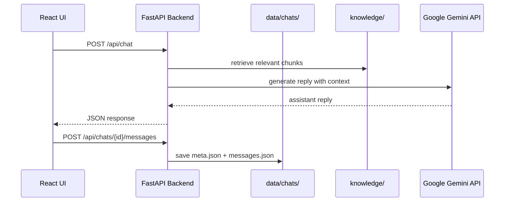

# Implementation Status

Technical reference for the US History Chatbot demo — what has been built, how it works, and where to find things in the codebase.

> **Last updated:** 2026-07-09 (all phases complete + post-phase enhancements)  
> **Related docs:** [setup.md](./setup.md) — install and usage · [plan.md](./plan.md) — requirements and phased plan

---

## Summary

| Phase | Status | Description |
|-------|--------|-------------|
| **Phase 1** | **Done** | Core text chat — React UI + FastAPI backend + Gemini API |
| **Phase 2** | **Done** | Multi-chat and local file persistence |
| **Phase 3** | **Done** | Voice input/output with icon-based controls — **verified** |
| **Phase 4** | **Done** | PDF knowledge base — load, chunk, retrieve, inject into prompts — **verified** |
| **Phase 5** | **Done** | Visual polish — header branding, demo-ready layout — **verified** |

### Post-phase enhancements

| Feature | Status |
|---------|--------|
| Delete chat | **Done** — trash icon + confirmation modal; `DELETE /api/chats/{id}` |
| Markdown rendering | **Done** — assistant replies rendered with `react-markdown` |
| Icon-based composer | **Done** — mic toggle, send icon (`react-icons`) |
| ChatGPT-style layout | **Done** — scrollable messages, fixed input bar at bottom |

**All planned demo phases and core enhancements are implemented.**

---

## Phase 5 — Visual Polish

### User-facing features

- **Header card** with US flag as background (subtle white overlay for readability)
- **Historical images** flanking the title — Declaration of Independence and Abraham Lincoln
- **Polished panels** — semi-transparent sidebar and chat window on gradient background
- **Larger typography** — increased base font size and header scale
- **Responsive layout** — stacked sidebar on narrow screens

### Assets (`frontend/public/images/`)

| File | Description |
|------|-------------|
| `us-flag.svg` | US flag (Wikimedia Commons) |
| `declaration.jpg` | John Trumbull, *Declaration of Independence* |
| `lincoln.jpg` | Abraham Lincoln portrait |

---

## Phase 4 — PDF Knowledge Base

### User-facing features

- Answers **blend** general US history with PDF content when relevant
- No knowledge-base badge in the UI (backend still loads and uses the PDF)

### Backend features

- Loads first `.pdf`, `.txt`, or `.md` from `knowledge/` on startup
- Extracts text with `pypdf` (PDF) or plain read (txt/md)
- Splits into overlapping chunks (~600 chars)
- Keyword retrieval — top 5 relevant chunks appended to system prompt per question
- `GET /api/knowledge/status` — load status
- `POST /api/knowledge/reload` — re-read files after replacing PDF

### Current sample file

- `knowledge/The Wilmington Coup of 1898.pdf` — 4 chunks loaded

### Verified

- PDF-specific questions answered using knowledge base material
- General US history questions still work (blend mode)
- Replace PDF + `POST /api/knowledge/reload` reloads without code changes

---

## Phase 3 — Voice Input & Output

### User-facing features

- **Mic button** next to send — toggles voice control bar (hidden by default)
- **Icon controls** in voice bar: mic (start), stop, trash (delete), send
- **Start** — records microphone audio + live speech-to-text
- **Stop** — ends recording; transcription shown for review
- **Delete** — discards recording and transcription
- **Send** — submits transcribed text (with audio saved if recorded)
- **Play** on user messages — replays saved voice recording
- **Speak** on assistant messages — browser text-to-speech (manual)
- Assistant replies remain **text only** (no assistant audio files)

### Backend features

- `POST /api/chats/{id}/audio` — upload user audio (`.webm`)
- `GET /api/chats/{id}/audio/{filename}` — stream saved recording
- Messages may include optional `audio_file` field in `messages.json`

---

## Phase 2 — Multi-Chat & Persistence

### User-facing features

- **+ New Chat** — starts a fresh conversation
- **Sidebar** — lists saved chats, sorted by most recently updated
- **Switch chats** — click a title to load history
- **Delete chat** — trash icon on hover → confirmation modal → removes chat + audio from disk
- **Auto-save** — after each exchange
- **Persist on refresh** — reloading restores saved chats
- **Auto-titled chats** — title from first user message (truncated at 60 chars)

### Backend features

- Local file storage under `data/chats/{chatId}/`
- UUID validation on chat IDs (prevents path traversal)
- `DELETE /api/chats/{id}` — removes entire chat directory
- 15-second request timeout — shows error instead of infinite "Loading chats…"

### Storage layout

```
data/chats/{chatId}/
├── meta.json
├── messages.json
└── audio/
    └── {uuid}.webm
```

---

## Phase 1 — Core Text Chat

### User-facing features

- Single-page chat UI at http://localhost:5173
- Text input with **send icon** (paper plane)
- User and assistant message bubbles ("You" / "Historian")
- **Markdown rendering** in assistant replies (bold, lists, headings, code)
- Loading indicator ("Thinking…") while waiting
- Error banner on API failure
- **Scrollable messages** with input bar fixed at bottom
- Auto-scroll to latest message
- **Multi-turn conversation** within a session

### Backend features

- FastAPI server on http://localhost:8000
- Proxies chat to **Google Gemini** (`gemini-2.5-flash`)
- US history **system prompt**
- API key from `.env` (never exposed to browser)
- CORS for Vite dev server
- `GET /api/health` health check

---

## Architecture



---

## Project Structure

```
ChatBot/
├── backend/
│   ├── main.py           # FastAPI routes
│   ├── llm.py            # Gemini client + system prompt
│   ├── storage.py        # Chat file I/O, audio, delete
│   ├── knowledge.py      # PDF load + retrieval
│   ├── config.py         # .env loading
│   └── requirements.txt
├── data/chats/           # Saved conversations (gitignored)
├── knowledge/            # PDF knowledge base (gitignored)
├── frontend/
│   ├── public/images/    # Flag + historical images
│   └── src/
│       ├── App.jsx               # Layout, chat state, delete modal
│       ├── App.css
│       ├── api/client.js         # API client
│       ├── utils/speech.js       # Speech recognition + TTS
│       └── components/
│           ├── ChatWindow.jsx    # Messages, input, voice toggle
│           ├── ChatList.jsx      # Sidebar + delete button
│           ├── VoiceControls.jsx # Icon-based voice bar
│           ├── MessageBubble.jsx # Markdown + Play/Speak
│           ├── HistoryGallery.jsx# Header images + title
│           └── ConfirmModal.jsx  # Delete confirmation
├── docs/
│   ├── setup.md          # Install, run, usage guide
│   ├── plan.md           # Requirements and phased plan
│   └── implementation.md # This file
├── .env                  # API key (gitignored)
├── .env.example
└── README.md
```

---

## API Endpoints

| Method | Endpoint | Purpose |
|--------|----------|---------|
| `GET` | `/api/health` | Health check |
| `POST` | `/api/chat` | Send messages, get assistant reply |
| `POST` | `/api/chats` | Create new chat (returns UUID) |
| `GET` | `/api/chats` | List saved chats |
| `GET` | `/api/chats/{id}` | Load chat with messages |
| `DELETE` | `/api/chats/{id}` | Delete chat and all files |
| `POST` | `/api/chats/{id}/messages` | Save full conversation |
| `POST` | `/api/chats/{id}/audio` | Upload voice recording |
| `GET` | `/api/chats/{id}/audio/{filename}` | Stream recording |
| `GET` | `/api/knowledge/status` | Knowledge base status |
| `POST` | `/api/knowledge/reload` | Reload knowledge base |

**Swagger UI:** http://localhost:8000/docs

### `POST /api/chat`

Send conversation history; receive next assistant reply.

```json
{
  "messages": [
    { "role": "user", "content": "Who was the first US president?" }
  ]
}
```

### `DELETE /api/chats/{id}`

Deletes `data/chats/{id}/` including `meta.json`, `messages.json`, and `audio/`.

**Response:** `{ "ok": true }`

---

## Frontend Components

| Component | Purpose |
|-----------|---------|
| `App.jsx` | Header, sidebar, active chat routing, delete modal |
| `ChatWindow.jsx` | Messages, scroll area, input bar, mic/send icons |
| `ChatList.jsx` | Saved chats, new chat, delete trash icon |
| `VoiceControls.jsx` | Collapsible voice bar with icon buttons |
| `MessageBubble.jsx` | Markdown rendering, Play/Speak actions |
| `HistoryGallery.jsx` | Header images flanking title |
| `ConfirmModal.jsx` | Styled delete confirmation dialog |
| `api/client.js` | All API calls with 15s timeout |
| `utils/speech.js` | Speech recognition, TTS, markdown strip for Speak |

---

## Configuration

File: `.env` (project root, gitignored)

```env
GEMINI_API_KEY=your-key-here
GEMINI_MODEL=gemini-2.5-flash
```

Get a free key: https://aistudio.google.com/apikey

---

## Dependencies

### Backend (`backend/requirements.txt`)

| Package | Purpose |
|---------|---------|
| `fastapi` | Web API framework |
| `uvicorn` | ASGI server |
| `google-generativeai` | Gemini SDK |
| `python-dotenv` | Load `.env` |
| `python-multipart` | Audio upload |
| `pypdf` | PDF text extraction |

### Frontend (`frontend/package.json`)

| Package | Purpose |
|---------|---------|
| `react`, `react-dom` | UI framework |
| `react-markdown` | Render assistant markdown replies |
| `react-icons` | Mic, send, stop, trash icons |
| `vite` | Dev server and build |

---

## How to Run

See **[setup.md](./setup.md)** for full instructions.

```powershell
# Terminal 1 — backend
cd backend
.\.venv\Scripts\Activate.ps1
uvicorn main:app --reload --port 8000

# Terminal 2 — frontend
cd frontend
npm run dev
```

Open http://localhost:5173 in Chrome or Edge.

---

## Known Issues

| Issue | Notes |
|-------|-------|
| Port 8000 stuck | Multiple uvicorn instances can wedge the port. `netstat -ano \| findstr :8000` then `taskkill /PID <pid> /F` |
| "Loading chats…" forever | Backend not responding — restart it; frontend times out after 15s |
| Internet required | Gemini API calls need network |
| Gemini 429 errors | Free tier rate limits; wait and retry |
| Voice features | Require Chrome or Edge; allow microphone permission |
| `google.generativeai` deprecation | Package shows deprecation notice; still works for demo |

---

## Project Complete

All five planned phases are implemented, plus delete chat, markdown rendering, icon-based voice UI, and ChatGPT-style layout.

Optional future enhancements (not in scope):

- Dark mode
- Export chat to PDF/text

See [plan.md](./plan.md) for the full project history.
