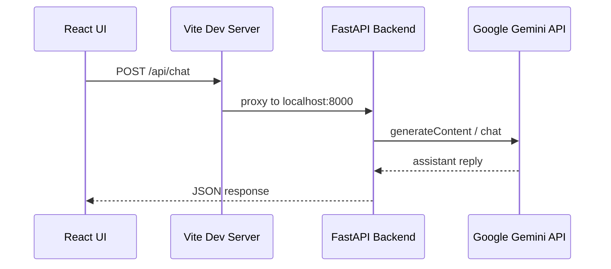

# Implementation Status

What has been built so far for the US History Chatbot demo.

> **Last updated:** Phase 1 complete  
> **Related docs:** [plan.md](./plan.md) · [setup.md](./setup.md)

---

## Summary

| Phase | Status | Description |
|-------|--------|-------------|
| **Phase 1** | **Done** | Core text chat — React UI + FastAPI backend + Gemini API |
| Phase 2 | Not started | Multi-chat and local persistence |
| Phase 3 | Not started | Voice input/output |
| Phase 4 | Not started | PDF knowledge base |
| Phase 5 | Not started | Visual polish (flag backdrop, images) |

---

## Phase 1 — What Works

### User-facing features

- Single-page chat UI at http://localhost:5173
- Text input and **Send** button
- User and assistant message bubbles ("You" / "Historian")
- Loading indicator ("Thinking…") while waiting for a reply
- Error banner if the API call fails
- Empty-state prompt when no messages yet
- Auto-scroll to the latest message
- **Multi-turn conversation** within a session (full message history sent to the backend each time)

### Backend features

- FastAPI server on http://localhost:8000
- Proxies chat requests to **Google Gemini** (`gemini-2.5-flash` by default)
- US history **system prompt** — keeps answers focused on American history
- API key loaded from `.env` (never exposed to the browser)
- CORS enabled for the Vite dev server
- Health check endpoint for verification

### Verified

- API test: *"Who was the first US president?"* → correct answer about George Washington
- Manual UI test: *"When did the US railroads start?"* → detailed answer about B&O railroad (1828)

---

## Phase 1 — What Does NOT Work Yet

These are planned for later phases:

| Feature | Phase |
|---------|-------|
| New chat / multiple conversations | Phase 2 |
| Saved chats (persist after refresh) | Phase 2 |
| Chat list sidebar | Phase 2 |
| Voice input (microphone) | Phase 3 |
| Voice output (text-to-speech) | Phase 3 |
| Saved audio recordings | Phase 3 |
| Friend's PDF knowledge base | Phase 4 |
| US flag backdrop and historical images | Phase 5 |

**Current limitation:** Refreshing the browser **clears the conversation**. Messages exist only in React state (in memory).

---

## Architecture (Phase 1)



---

## Project Structure (current)

```
ChatBot/
├── backend/
│   ├── main.py           # FastAPI app, routes, CORS
│   ├── llm.py            # Gemini client and chat logic
│   ├── config.py         # .env loading, system prompt
│   ├── requirements.txt  # Python dependencies
│   └── .venv/            # Python virtual environment (local, not committed)
├── frontend/
│   ├── src/
│   │   ├── App.jsx               # Page layout and header
│   │   ├── App.css               # Chat UI styles
│   │   ├── main.jsx              # React entry point
│   │   ├── index.css             # Global styles
│   │   ├── api/
│   │   │   └── client.js         # fetch wrapper for /api/chat
│   │   └── components/
│   │       ├── ChatWindow.jsx    # Chat state, input form, message list
│   │       └── MessageBubble.jsx # Single message bubble
│   ├── index.html
│   ├── package.json
│   └── vite.config.js    # Dev server + API proxy
├── docs/
│   ├── plan.md           # Requirements and phased plan
│   ├── setup.md          # Install and run instructions
│   └── implementation.md # This file
├── .env                  # API key (gitignored)
├── .env.example          # Template for .env
├── .gitignore
└── README.md
```

---

## API Endpoints

### `GET /api/health`

Health check.

**Response:**

```json
{
  "status": "ok",
  "model": "gemini-2.5-flash"
}
```

**Try it:** http://localhost:8000/api/health  
**Swagger UI:** http://localhost:8000/docs

---

### `POST /api/chat`

Send a conversation and receive the assistant's next reply.

**Request body:**

```json
{
  "messages": [
    { "role": "user", "content": "Who was the first US president?" }
  ]
}
```

For multi-turn chat, include the full history:

```json
{
  "messages": [
    { "role": "user", "content": "Who was Lincoln?" },
    { "role": "assistant", "content": "Abraham Lincoln was the 16th president..." },
    { "role": "user", "content": "When was he president?" }
  ]
}
```

**Response:**

```json
{
  "message": {
    "role": "assistant",
    "content": "George Washington was the first President of the United States."
  }
}
```

**Errors:**

| Code | Cause |
|------|-------|
| 400 | Invalid request (empty messages, last message not from user) |
| 502 | Gemini API error (bad key, quota exceeded, network issue) |

---

## Frontend Components

### `App.jsx`

- Page header: "US History Chat"
- Renders `ChatWindow`

### `ChatWindow.jsx`

- Holds `messages` state (in memory only)
- Handles form submit → calls `sendChat()` → appends reply
- Shows loading and error states
- Auto-scrolls to bottom on new messages

### `MessageBubble.jsx`

- Renders a single user or assistant message
- User messages: right-aligned, dark blue
- Assistant messages: left-aligned, light grey

### `api/client.js`

- `sendChat(messages)` — POST to `/api/chat`
- Uses Vite proxy (no hardcoded backend URL in dev)

---

## Backend Modules

### `config.py`

- Loads `.env` from project root
- Exports `GEMINI_API_KEY`, `GEMINI_MODEL`, `SYSTEM_PROMPT`

### `llm.py`

- Configures `google-generativeai` SDK
- Maps roles: `user` → `user`, `assistant` → `model` (Gemini format)
- Sends conversation history for multi-turn chat
- Applies US history system instruction to every request

### `main.py`

- FastAPI application
- Request/response validation with Pydantic
- CORS for `localhost:5173`

---

## Configuration

File: `.env` (project root, gitignored)

```env
GEMINI_API_KEY=your-key-here
GEMINI_MODEL=gemini-2.5-flash
```

| Variable | Required | Default | Description |
|----------|----------|---------|-------------|
| `GEMINI_API_KEY` | Yes | — | Google AI Studio API key |
| `GEMINI_MODEL` | No | `gemini-2.5-flash` | Gemini model name |

Get a free key: https://aistudio.google.com/apikey

---

## Dependencies

### Backend (`backend/requirements.txt`)

| Package | Purpose |
|---------|---------|
| `fastapi` | Web API framework |
| `uvicorn` | ASGI server |
| `google-generativeai` | Gemini SDK |
| `python-dotenv` | Load `.env` file |

### Frontend (`frontend/package.json`)

| Package | Purpose |
|---------|---------|
| `react`, `react-dom` | UI framework |
| `vite` | Dev server and build tool |
| `@vitejs/plugin-react` | React support for Vite |

---

## How to Run (Phase 1)

See [setup.md](./setup.md) for full instructions. Quick version:

**Terminal 1 — backend:**

```powershell
cd backend
.\.venv\Scripts\Activate.ps1
uvicorn main:app --reload --port 8000
```

**Terminal 2 — frontend:**

```powershell
cd frontend
npm run dev
```

Open http://localhost:5173

---

## Known Issues and Notes

| Issue | Notes |
|-------|-------|
| Port 8000 in use | Stop other processes: `netstat -ano \| findstr :8000` then `taskkill /PID <pid> /F` |
| WinError 10013 on port 8000 | Usually means port already occupied |
| Conversation lost on refresh | Expected until Phase 2 |
| Internet required | Gemini API calls need network access |
| Gemini 429 errors | Free tier rate limits; wait and retry, or confirm `GEMINI_MODEL=gemini-2.5-flash` |
| Deprecation warning | `google.generativeai` package shows a deprecation notice; still works for this demo |

---

## Tech Decisions (Phase 1)

| Decision | Choice | Reason |
|----------|--------|--------|
| LLM | Google Gemini free API | No payment required for demo |
| Model | `gemini-2.5-flash` | Verified working on free tier |
| Frontend | React + Vite | Fast to build, good dev experience |
| Backend | Python FastAPI | Simple API proxy, easy PDF support later |
| State | In-memory (React) | Sufficient for Phase 1; persistence in Phase 2 |
| API key storage | `.env` on backend | Key never sent to browser |

---

## Next Up: Phase 2

Planned work:

- `POST /api/chats` — create new chat
- `GET /api/chats` — list saved chats
- `GET /api/chats/{id}` — load messages
- `POST /api/chats/{id}/messages` — save messages
- Local file storage under `data/chats/`
- UI: **New Chat** button + sidebar chat list
- Auto-save after each exchange
- Chat titles from first user message

See [plan.md](./plan.md) for full Phase 2 spec.
