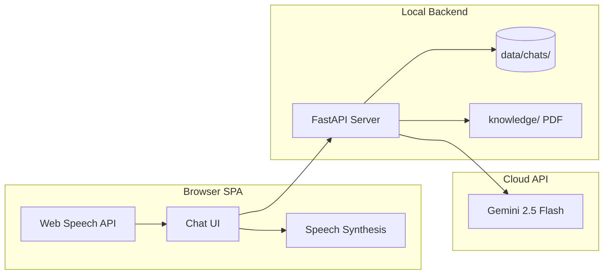

# US History Chatbot — Requirements & Phased Plan

> Initial project plan for a local demo chatbot focused on US history.

**Setup guide (for your machine and your friend's laptop):** [setup.md](./setup.md)  
**Implementation status (what's built):** [implementation.md](./implementation.md)

## Implementation Checklist

- [x] **Phase 1:** Scaffold React + FastAPI, wire LLM chat endpoint, basic chat UI
- [ ] **Phase 2:** Multi-chat CRUD, local file storage, chat list sidebar
- [ ] **Phase 3:** Web Speech API input/output, save/replay audio blobs
- [ ] **Phase 4:** PDF ingestion, chunk retrieval, inject into LLM context
- [ ] **Phase 5:** US flag backdrop, historical images, demo-ready styling

---

## Clarifications Resolved

| Topic | Decision |
|-------|----------|
| **Super Grok subscription** | Does **not** include API access. It only unlocks features in the Grok app (X/Twitter). Not needed for this project. |
| **LLM provider** | **Google Gemini free API**. Default model: **`gemini-2.5-flash`** (verified working on free tier). API key from [aistudio.google.com/apikey](https://aistudio.google.com/apikey). No credit card required. |
| **API key storage** | Store in `.env` as `GEMINI_API_KEY`. Gitignore `.env` and `API_key.txt`. Each laptop should use its own key (see [setup.md](./setup.md)). |
| **Knowledge base format** | Friend has a **PDF**. We'll support PDF ingestion; if extraction quality is poor, fallback to `.txt`/`.md` is fine. |
| **Knowledge base behavior** | **Blend** — general US history knowledge plus friend's PDF material when relevant. Not PDF-only. |
| **Voice output UX** | **Manual** — speaker/play button on each assistant message (no auto-speak on every reply). |
| **Tech stack** | **React + Vite** frontend, **Python FastAPI** backend — confirmed. |
| **Deployment target** | Local demo on Windows — developer machine first, then friend's laptop (full setup in [setup.md](./setup.md)). |

---

## API Key Setup (Gemini)

1. Create a key at [Google AI Studio](https://aistudio.google.com/apikey)
2. Put it in `.env` at the project root (see [setup.md — Configure the API key](./setup.md#configure-the-api-key))
3. Use model **`gemini-2.5-flash`** — tested and working; `gemini-2.0-flash` may hit free-tier quota limits
4. Do **not** commit `.env`, `API_key.txt`, or share keys in chat/email

Example `.env`:

```env
GEMINI_API_KEY=your-key-here
GEMINI_MODEL=gemini-2.5-flash
```

---

## Requirements Summary (What We're Building)

### Must-have (functional first)

- Single-page web app with a **chat window** (message list + text input)
- AI assistant focused on **US history** (system prompt + optional knowledge base)
- **New chat** button to start fresh conversations
- **Save/load past chats** locally on disk, including **audio recordings** per message
- **Voice input** (speech-to-text) and **voice output** (text-to-speech)
- Runs **entirely locally** on your machine (browser + small local server)
- Friend's **PDF knowledge base** merged into answers

### Nice-to-have (after functional)

- US flag backdrop and historical images for atmosphere
- Chat list sidebar to browse saved sessions

### Out of scope (for this demo)

- User accounts, cloud hosting, multi-user access
- Production-grade security or scaling
- Mobile app

---

## Recommended Architecture



**Why this stack (simple for a first chatbot):**

- **Frontend:** React + Vite — fast to scaffold, good for a chat UI
- **Backend:** Python **FastAPI** — easy PDF parsing, file storage, and API proxy (keeps your API key off the frontend)
- **Storage:** Local filesystem under `data/chats/{chatId}/`
  - `meta.json` — title, created date
  - `messages.json` — role, text, timestamps, audio file refs
  - `audio/` — `.webm` blobs for voice messages
- **Voice:** Browser **Web Speech API** (free, no extra API keys)
  - `SpeechRecognition` for voice input
  - `speechSynthesis` for voice output
  - Limitation: works best in Chrome/Edge; quality is demo-grade, not broadcast-grade
- **Knowledge base:** Extract text from PDF → chunk → simple keyword/semantic retrieval → inject top chunks into LLM context (lightweight RAG, no vector DB needed for a one-time demo)
- **LLM:** Google Gemini API via `google-generativeai` Python SDK (default model: **`gemini-2.5-flash`**)

---

## Phased Task Breakdown

### Phase 1 — Core Text Chat (get it working)

**Goal:** Send a message, get a US-history-focused AI reply in the browser.

- Scaffold React + Vite frontend and FastAPI backend
- Add `.env` with `GEMINI_API_KEY` and `GEMINI_MODEL=gemini-2.5-flash`
- Implement `POST /api/chat` — forwards messages to LLM with a US history system prompt
- Basic chat UI: message bubbles, text input, send button, loading indicator
- Document setup in [setup.md](./setup.md)
- **Exit criteria:** You can ask "Who was the first president?" and get a sensible answer

### Phase 2 — Multi-Chat & Local Persistence

**Goal:** Create new chats, switch between them, survive browser refresh.

- `POST /api/chats` — create new chat
- `GET /api/chats` — list saved chats
- `GET /api/chats/{id}` — load messages
- `POST /api/chats/{id}/messages` — append user + assistant messages
- Auto-save after each exchange
- UI: "New Chat" button + sidebar list of past chats
- **Exit criteria:** Two separate conversations persist after restart

### Phase 3 — Voice Input & Output

**Goal:** Talk to the bot and hear replies spoken aloud.

- Mic button → Web Speech API → transcribed text → send as normal message
- Store raw audio blob alongside the message in `data/chats/{id}/audio/`
- Speaker/play button on each assistant message → `speechSynthesis` (manual, not auto-play)
- Playback button on saved messages to replay stored audio
- **Exit criteria:** Voice question → text reply → spoken reply; reload chat and replay audio

### Phase 4 — PDF Knowledge Base

**Goal:** Friend's PDF content influences answers.

- Drop PDF into `knowledge/` folder
- Backend extracts text (e.g. `pypdf`), splits into chunks
- On each question: retrieve top 3–5 relevant chunks → append to system prompt
- Optional: simple admin note in UI showing "Knowledge base loaded: N chunks"
- Fallback: if PDF extraction is messy, friend provides `.txt`/`.md` instead (same pipeline)
- **Exit criteria:** Ask about something **only in the PDF** — bot answers using that material

### Phase 5 — Visual Polish

**Goal:** Make the demo presentable.

- US flag as subtle page backdrop (CSS, low opacity)
- 2–3 historical images (public domain from Wikimedia) in header or sidebar
- Title branding: e.g. "US History Chat"
- Responsive layout cleanup
- **Exit criteria:** Looks intentional for a demo presentation

---

## Project Layout (planned)

```
ChatBot/
├── docs/
│   ├── plan.md          # this file
│   └── setup.md         # full setup guide (both laptops)
├── frontend/            # React + Vite SPA
│   └── src/
│       ├── App.jsx
│       ├── components/  # ChatWindow, ChatList, MessageBubble, VoiceControls
│       └── api/client.js
├── backend/
│   ├── main.py          # FastAPI routes
│   ├── llm.py           # Gemini client
│   ├── storage.py       # chat file I/O
│   └── knowledge.py     # PDF load + retrieval
├── data/chats/          # persisted sessions (gitignored)
├── knowledge/           # friend's PDF goes here
├── .env                 # GEMINI_API_KEY (gitignored)
├── .env.example         # GEMINI_API_KEY placeholder
└── README.md            # quick pointer to docs/setup.md
```

---

## What You Need Before Phase 1

1. **Gemini API key** from [aistudio.google.com/apikey](https://aistudio.google.com/apikey) — obtained and verified
2. **Node.js** (v18+) and **Python** (3.10+) installed locally — ready
3. **Chrome or Edge** browser (for Web Speech API in Phase 3) — ready
4. **Setup docs** — [setup.md](./setup.md) for friend laptop transfer

---

## Risks & Mitigations

| Risk | Mitigation |
|------|------------|
| Super Grok ≠ API | Using Gemini free API instead — no Grok/xAI needed |
| Gemini free tier rate limits | Use `gemini-2.5-flash`; retry after 429; documented in [setup.md](./setup.md) |
| Some Gemini models quota = 0 on free tier | Verified `gemini-2.5-flash` works; avoid `gemini-2.0-flash` as default |
| API key in plain text file | Use `.env`; gitignore `.env` and `API_key.txt`; friend gets own key |
| Friend laptop setup friction | Full step-by-step in [setup.md](./setup.md) |
| PDF text extraction poor (scanned PDF) | Ask friend for text-based PDF or `.txt`/`.md` export |
| Web Speech API browser quirks | Document "use Chrome/Edge"; test mic permissions early |
| Voice quality not impressive | Acceptable for demo; cloud TTS (ElevenLabs) is optional upgrade |

---

## Suggested Demo Script (for your friend)

1. Open app → see US-themed landing/chat
2. Ask a general question: *"What caused the American Civil War?"*
3. Ask something from his PDF: *[topic only in his material]*
4. Start a **new chat**, show old one is saved
5. Use **mic** to ask a question, hear spoken reply
6. Reload page — chats and audio still there

---

## Minor Defaults (non-blocking)

These use sensible defaults unless changed later:

- **Chat titles:** Auto-named from the first user message
- **Historical images:** Generic public-domain US history images unless friend specifies topics
- **Ports:** Frontend `localhost:5173`, backend `localhost:8000`
- **Offline:** Not supported for new AI replies — Gemini API requires internet; chats/audio/PDF stay local
- **Default model:** `gemini-2.5-flash` (override via `GEMINI_MODEL` in `.env`)
